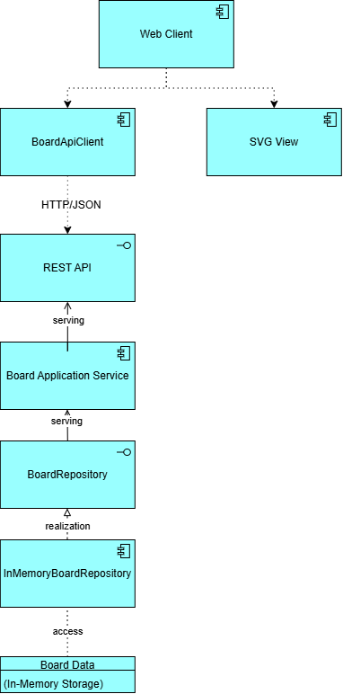
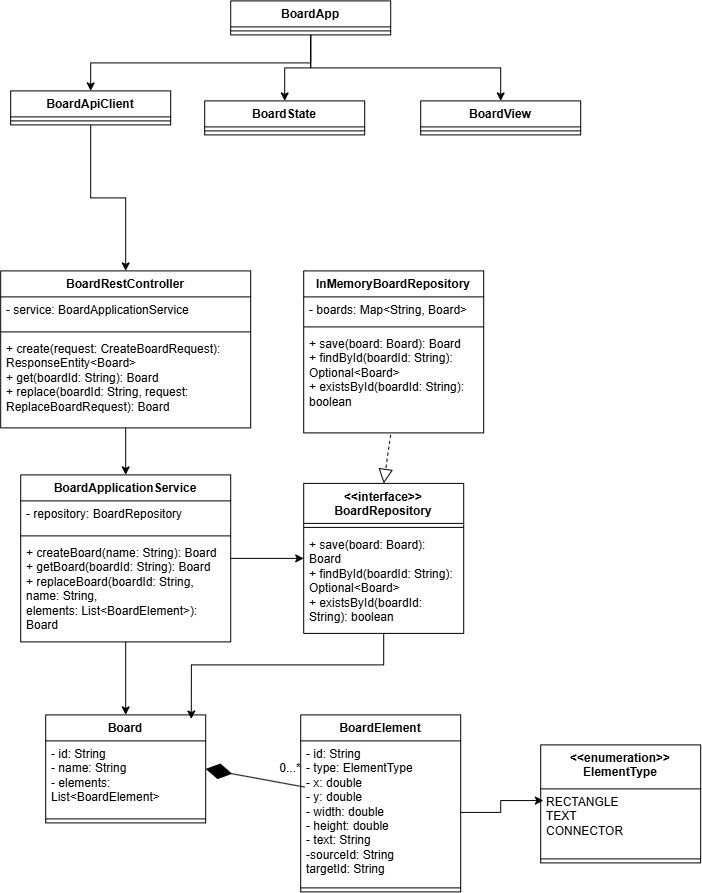

# Architecture Evidence — Lab 05

1. **ArchiMate Application View**

   
2. **Class diagram**

## Quality rule

The diagrams must describe the code that is actually delivered. Avoid decorative boxes and avoid generated diagrams containing every framework class.
